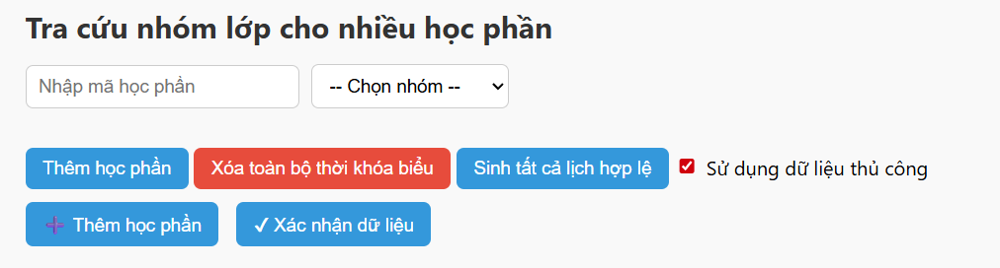
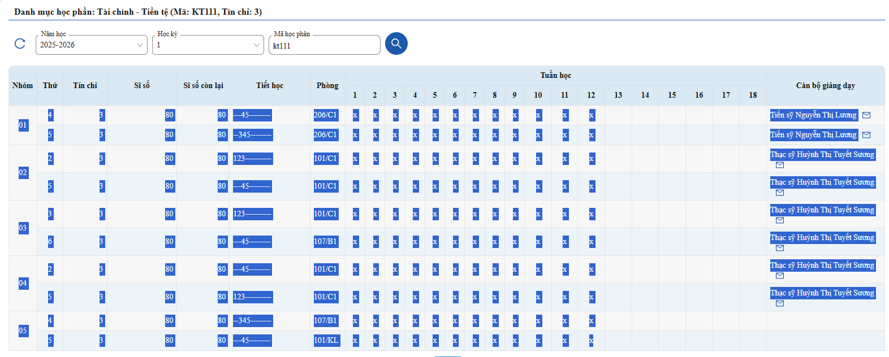
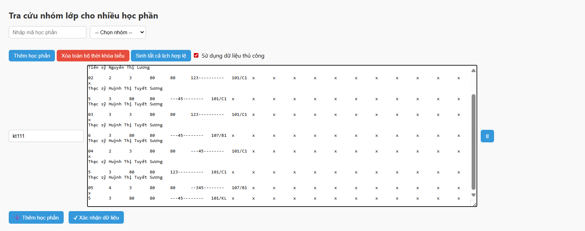

# tkb_ctu

Trang web hỗ trợ soạn thời khóa biểu cho sinh viên Đại học Cần Thơ.

##  Dữ liệu

Dữ liệu từ có sẵn từ file "data.csv" được dùng cho học kỳ 1 năm học 2025–2026. Hiện tại chỉ hỗ trợ:

- Các học phần thuộc trường Công nghệ Thông tin & Truyền thông (CT086 -> CT056H)
- Các học phần Chính trị (mã từ ML007 -> ML402)

Đối với các bạn học khoa khác, vui lòng tự thêm dữ liệu.

##  Cách thêm dữ liệu
1. Nhấn chọn vào ô "Sử dụng dữ liệu thủ công"
   

2. Vào trang HTQL, tìm học phần bạn muốn thêm (VD: `KT111`), bôi đen thông tin các lớp, rồi copy.  
   

3. Quay lại trang web, dán dữ liệu vừa copy vào ô nhập.
   

4. Làm tương tự với các học phần khác. Sau khi thêm xong, nhấn "Xác nhận dữ liệu".

 **Lưu ý**: Nếu không thông báo lỗi thì đã OK. 

---

## Cách soạn thời khóa biểu

Nhấn thêm từng mã học phần mà bạn muốn.
Cách sử dụng đơn giản thì bạn chỉ cần nhấn "Sinh tất cả lịch hợp lệ", trang web sẽ tìm kiếm toàn bộ thời khóa biểu có thể từ các học phần bạn chọn. Hoặc bạn có thể tự chọn từng lớp học ở mục kế bên mã học phần.

---

## Lưu ý

Sau khi chọn được thời khóa biểu ưng ý, hãy kiểm tra lại thông tin trên hệ thống HTQL để đảm bảo tính chính xác. Dữ liệu trên trang web có thể không đúng.

---

## Cuối cùng
Trang web được xây dựng bởi ChatGPT, hãy cảm ơn ChatGPT. Mình không có học nhiều về web, nên nếu có vấn đề gì về code, vui lòng hãy đóng góp.

